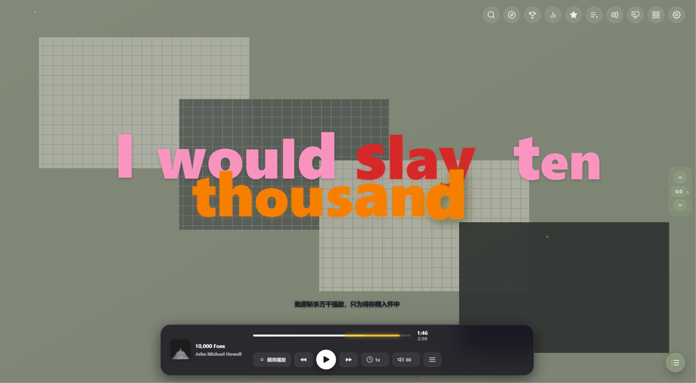
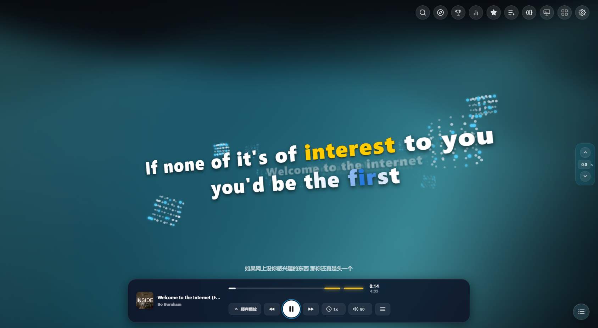
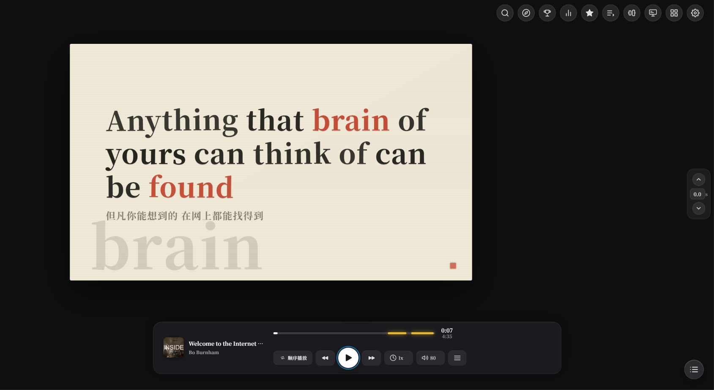
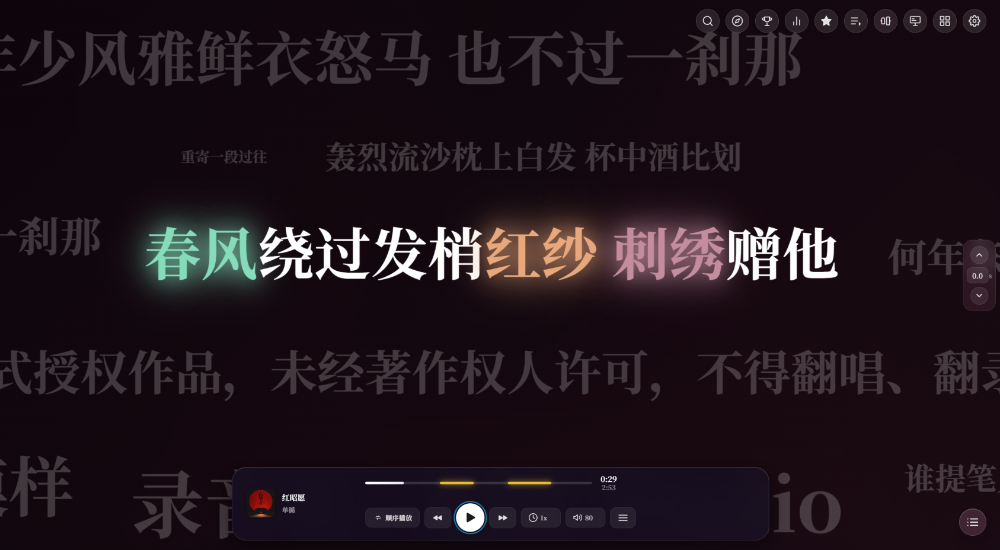
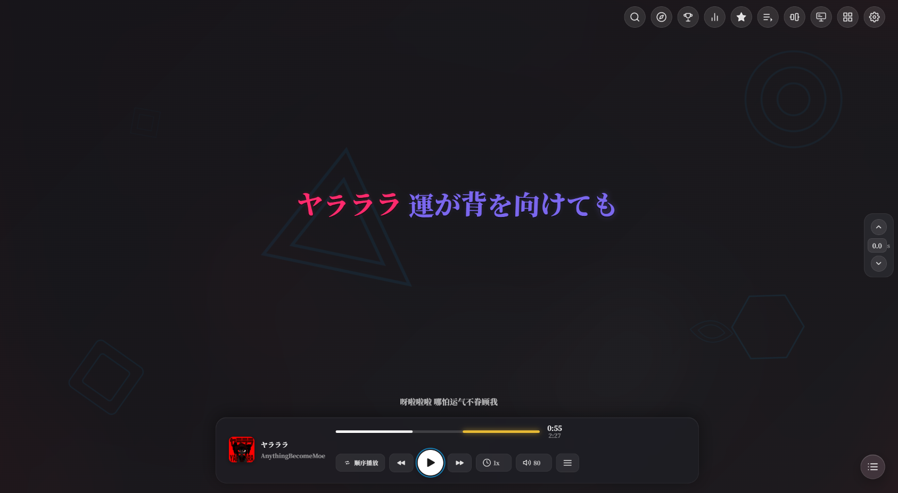
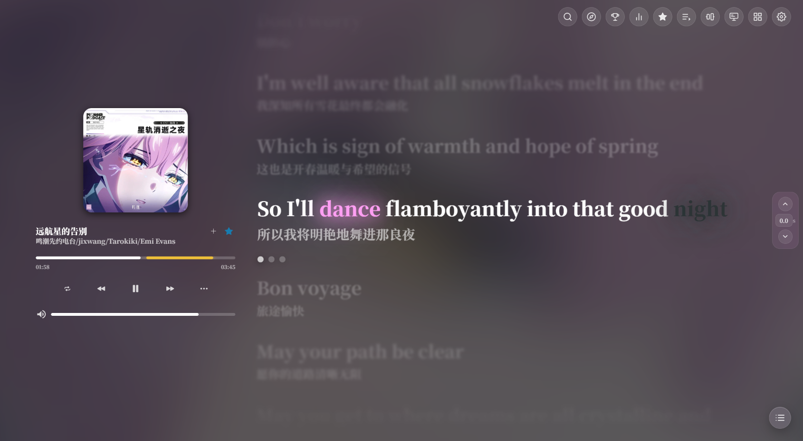
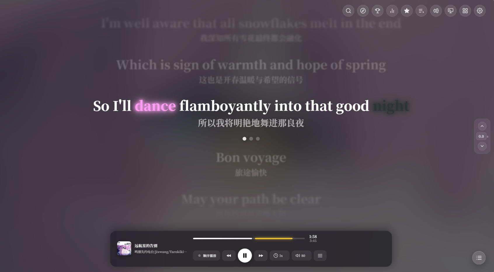

<div align="center">


# Aria Lyric Player

[简体中文](README.md) | **English**

[](https://github.com/zsjsll114/Aria/releases/latest)
[](https://github.com/zsjsll114/Aria/releases/latest)
[](LICENSE)

**A multi-source online music player built around word-by-word lyrics: QQ / KuGou / Netease / Kuwo / Soda search, nine full-screen lyric visual modes, a desktop lyrics overlay, a phone remote, and AI mood analysis**

Web app + Tauri 2 desktop shell — a player built for one person's long listening sessions.

[Visual Showcase](#nine-lyric-visuals) ·
[Core Features](#core-features) ·
[Quick Start](#quick-start) ·
[FAQ](#faq) ·
[Architecture](#architecture) ·
[License](#license)

</div>

---

For personal use only. This repository contains no audio, lyrics, or cover art; online music-source APIs are provided at runtime by third-party open-source projects running locally — see the [Disclaimer](#third-party-sources-and-disclaimer) at the bottom.

## Nine Lyric Visuals

Beyond the default cover layout, there are nine full-screen lyric visuals, switchable from the style picker:

| Mode | Description |
|---|---|
| Cover | Cover art and lyrics side by side, with the full control bar |
| Lyrics | Full-screen lyrics + mini bottom bar, word-by-word highlighting with smooth scrolling, translation / romaji lines |
| Fly-In | Dark & minimal, characters fly in and glow — great for singing along |
| WordCloud | 2D word-cloud layout, damped camera focus tracking, per-word fill |
| Verse | Multi-shot lyric film: giant close-ups / magazine layouts / collage fragments, per-word dispersion & camera moves, purely timeline-driven |
| Tempera | Halftone-print lyric PV: color-block compositions with cut-out windows + dynamic lyric inversion + 121 camera variants |
| Scroll | The whole song as one horizontal scroll: time advances leftward, sung lines stay on the roll as history, chapter color bands, no jump cuts |
| Mondrian | Mondrian-style color-block collage: blocks split by line meaning, 8 geometric compositions, word blocks snap to color blocks with collision avoidance |
| Tunnel | 3D particle flow in space, depth-of-field follows the theme color |
| Letterpress | Letterpress layout: sung characters are inked in one by one, paper color follows section mood |

<table>
  <tr>
    <td align="center" width="33%"><br><sub><b>Mondrian</b></sub></td>
    <td align="center" width="33%"><br><sub><b>Tunnel</b></sub></td>
    <td align="center" width="33%"><br><sub><b>Letterpress</b></sub></td>
  </tr>
  <tr>
    <td align="center"><br><sub><b>WordCloud</b></sub></td>
    <td align="center"><br><sub><b>Fly-In</b></sub></td>
    <td align="center"><br><sub><b>Lyrics</b></sub></td>
  </tr>
  <tr>
    <td align="center"><br><sub><b>Lyrics</b> (clean layout)</sub></td>
    <td align="center" colspan="2"><sub>Screenshots for Verse / Tempera / Scroll to be added</sub></td>
  </tr>
</table>

Everything shines brighter with AI mood analysis enabled: per-line emotion tags and chorus detection drive mood-aware palettes and compositions in the visual modes. No AI key? All modes still work — they fall back to purely timeline-driven behavior.

RTL lyrics (Arabic / Hebrew etc.) light up right-to-left automatically in every visual mode, no configuration needed.

## Core Features

| Module | Description |
|---|---|
| Word-by-word lyrics | YRC / KRC / QRC full-format word timelines, original / translation / romaji three-line layout; automatic alignment fallback when word timing is missing |
| Multi-source search | QQ Music / KuGou / Netease / Kuwo, multi-tier racing & aggregated fallback with a transparent resolve pipeline; hi-fi & daily mixes via self-hosted services. Soda Music runs on the local self-hosted source: search and word-by-word lyrics need no login, its daily mix (ByteDance feed) and "My playlists" are wired up, playback needs a QR scan, and it has no charts — the charts page stays 3-platform |
| AI mood analysis | Gemini or OpenAI-compatible APIs: per-line emotion tagging + chorus detection, driving layout & palette changes in visual modes |
| Desktop lyrics | Standalone transparent window, free drag, click-through, local per-word interpolation |
| Phone remote | Scan or type the address on your phone (same LAN) to control playback / track / volume (requires `--lan`) |
| Local music | Local library scan + Enhanced LRC word-timeline generation + song recognition (Shazam / Vosk) |
| Playlists & favorites | Favorites / playlists / public playlist import from Netease, QQ & KuGou / play stats |
| Audio | 10-band equalizer, speed control (pitch preserved), long-press 2× fast-forward, A-B loop, seamless crossfade, downloads, sleep timer |
| Experience details | In-lyrics search, bilingual layout, next-song preview, OSD hints, zen / focus mode, theme palette, VFX intensity slider, toolbar customization |

## Quick Start

### Portable build (regular users)

Grab `Aria-Portable.zip` from [Releases](../../releases), extract to a path with **ASCII characters only**, then:

- `Aria.exe` — desktop window version (recommended)
- `StartAria.bat` — browser web version

No Python / Node installation needed; all dependencies are bundled.

### Running from source

Prerequisites: Python 3.10+ (backend uses stdlib only), Node.js 20.19+ or 22.13+ (22 LTS recommended), Git. The desktop shell needs the Rust toolchain.
The Node floor comes from two dependencies: the QQ music-source mirror requires `^20.17.0 || >=22.9.0`, and this repo's ESLint 10 requires `^20.19.0 || ^22.13.0 || >=24`.

```bat
:: 1. Fetch music-source services into _eval\ (not committed; required once after a fresh clone)
scripts\setup-vendors.bat

:: 2. Start the local server (listens on localhost only by default)
python server.py

:: 3a. Web: open http://localhost:8001 in your browser
:: 3b. Desktop: double-click restart-aria.bat (restart + incremental cargo build, first run compiles)
```

macOS / Linux have no .bat files — run the equivalent commands manually.

## Before You Start (read these three)

1. **Mainland users going through a Cloudflare Worker proxy for AI: the page URL must be `http://localhost:8001`**, not `127.0.0.1` — the Worker validates by page Origin, and `127.0.0.1` gets `403 Forbidden`. Calling the API directly (no Worker) has no such restriction.
2. **The server listens on localhost only by default.** To use it from your phone (including the phone remote), run `python server.py --lan`. This exposes search, proxy and config APIs (including AI keys) to your LAN — home WiFi only, turn it off afterwards.
3. **Music-source services need separate logins.** Without login it automatically falls back to the free source pool: search and playback still work, but no hi-fi, daily mixes or playlist sync. Login lives in Settings → Self-Hosted.

## Feature Guide

### Desktop Lyrics

Toggle via the "Desktop Lyrics" button at the top right. Drag the lyric bar to move it, ✕ to close, the lock button toggles click-through. Position is saved automatically after dragging. Font size, color, stroke and fonts are in Settings → Interface.

### Phone Remote

Start with `python server.py --lan`, then open `http://<your-LAN-IP>:8001/remote.html` in your phone browser (the server prints the usable address on startup). Play / pause / skip / volume work remotely, with live lyric progress sync.

### Fonts

- Pick the global font in Settings → Fonts; each visual mode can override it in its own section under Settings → Appearance.
- **Drop files into the font folder**: put `.ttf / .otf / .woff / .woff2` files into `src/font/` at the project root (create it if missing), refresh, and they appear in every font dropdown.
- The font manager auto-categorizes into Serif / Hei / Kai / Pixel / Monospace with collapsible groups.
- Recommended fonts (large glyph coverage, free for commercial use): Noto Sans SC, Noto Serif SC, MiSans, HarmonyOS Sans, LXGW WenKai.
- **Prefer static-weight versions**: variable fonts (VF, often `-VF` in the filename) are expensive to render at full-screen sizes and may cause frame drops on low-end devices.

### Playlists & Favorites

Favorites: the heart button at the end of any row. Playlists: create / rename / delete on the "Playlists" page, with import from public Netease / QQ / KuGou playlist links.

### AI Mood Analysis

Fill in an API key under Settings → AI (Gemini official and OpenAI-compatible endpoints both supported). For mainland networks a Cloudflare Worker proxy is recommended (`docs/cf-gemini-auth-worker.js` has a ready-made script); direct API URLs work too. Keys are stored only in your local `user_config.json` and never uploaded.

## Known Limitations

- Multi-monitor / mixed-DPI setups are not fully tested; external screens may show cursor or positioning offsets.
- Visual modes are GPU-heavy at fullscreen + high refresh rate; rendering does not auto-throttle when minimized.
- Variable fonts (VF) as the global font are expensive to interpolate at full-screen sizes — low-end devices should use static-weight fonts (e.g. Noto Sans SC Bold) or lower the performance tier.
- Embedded lyrics (USLT / multi-track AWLRC) may pick the wrong track on some files.

## About How This Is Built

This project is developed with extensive AI assistance: product shape, architecture decisions and code review are done by the author, while a large share of implementation, refactoring, tests and documentation is produced in collaboration with AI. No need to worry about who wrote what when filing issues — just report normally.

## FAQ

- **Blank page / can't connect**: make sure the server window is still open and port 8001 isn't taken; on desktop check `server_debug.log`.
- **Search returns nothing**: try another source; if all fail it's most likely a temporary third-party API outage — retry later.
- **Hi-fi options are greyed out**: login to that platform's self-hosted service is required.
- **AI always returns 403**: your page URL isn't `localhost` — see note 1 above.
- **Desktop lyrics in the wrong place after restart**: wait a moment after dragging before closing; if it still misbehaves, lock → unlock once.
- **Phone remote won't connect**: make sure the server was started with `--lan` and your phone is on the same WiFi.

Please report issues with the [ISSUE template](.github/ISSUE_TEMPLATE/bug_report.md) — attaching console errors and system info speeds things up a lot.

## Architecture

```
Tauri 2 shell (Rust) ── loads http://localhost:8001, spawns sidecars
        │
Python backend (stdlib-only http.server, port 8001)
  ├ serves web/ statically + /proxy + /api/* (incl. /api/remote/* phone-remote bus)
  └ selfhost_service.py: four Node music-source sidecars (3100/3200/3201/3300, loopback-only)
```

The frontend is a framework-free sharded module system (`web/src/app/*.js`, loaded by number), with visual engines in `web/src/core/` (pvEngine / tunnelEngine / visualizers). See [AGENTS.md](AGENTS.md) and [CODE_WIKI.md](CODE_WIKI.md) for details.

## Third-Party Sources and Disclaimer

The `_eval/` directory holds local mirrors of third-party music-source API projects (KuGouMusicApi / NeteaseCloudMusicApi / qq-music-api-node, plus the npm library `ly-music-source` used for Soda), cloned and installed by `scripts/setup-vendors.bat`. They are **not part of this repository**, follow their original licenses, and are maintained independently upstream. This project merely calls them on 127.0.0.1 and does not modify their upstream logic (`patches/` contains local fixes for the QQ mirror, used by this project only). Soda needs an extra HTTP adapter, `scripts/qishui-server.mjs` (in-repo, version-controlled), because its upstream is a library rather than a service.

On top of that:

1. This repository contains and distributes no audio, lyrics, or cover art. Media content either comes from files already on your machine or is returned at runtime by the third-party APIs above.
2. Third-party APIs may change or break at any time; no availability is guaranteed.
3. This project is a personal-learning, personal-use player frontend. Please check the terms of service and copyright rules that apply in your region, and support official releases where you can. Do not use this project or its packaged builds for commercial distribution.

## Acknowledgements

- [folia-major](https://github.com/chthollyphile/folia-major) (AGPL-3.0) — **source of the code for the "Verse" (`sonnet/`) and "Tempera" (`tempera/`) visual engines** (faithful line-by-line port); see [THIRD_PARTY_NOTICES.md](THIRD_PARTY_NOTICES.md) for the full file list
- [JPV Lyrics Motion Kit](https://github.com/donbeeshyvt-jpg/jpv-lyrics-motion-kit) (AGPL-3.0) — source of the tunnel mode's per-word entrance themes, the PV background shape field and the Cadenza per-word light sweep (adapted)
- [KuGouMusicApi](https://github.com/makbkf/KuGouMusicApi) / [NeteaseCloudMusicApi](https://github.com/Binaryify/NeteaseCloudMusicApi) / [qq-music-api-node](https://github.com/jsososo/QQMusicApi) — music-source APIs
- [Tauri](https://tauri.app/) · [segmentit](https://github.com/nekobato/segmentit) · [kuromoji.js](https://github.com/takuyaa/kuromoji.js)
- Fonts: Noto Sans SC / Noto Serif SC (Noto CJK, SIL OFL) · LXGW family · Fangzheng Pixel · Cubic 11

## License

[AGPL-3.0](LICENSE). The project as a whole is released under the GNU Affero General Public License v3.0.

**Why not MIT**: the "Verse" (`web/src/core/visualizers/sonnet/`) and "Tempera" (`web/src/core/visualizers/tempera/`) visual engines, plus several utility modules (`pixiTextureBudget.js`, `utils/lyrics/*`, …), are **faithful line-by-line ports** of [chthollyphile/folia-major](https://github.com/chthollyphile/folia-major) (**AGPL-3.0**); some per-word entrance themes in the tunnel mode are adapted from JPV Lyrics Motion Kit (AGPL-3.0). AGPL's copyleft nature means the combined work must be released under AGPL-3.0 — the earlier MIT label did not hold for those parts and has been corrected.

- Third-party licenses and a **per-file origin list**: [THIRD_PARTY_NOTICES.md](THIRD_PARTY_NOTICES.md)
- Code that is original to this project may still be licensed separately by its copyright holder (e.g. under MIT), but this repository and its builds are an AGPL-3.0 combined work.
- The music-source API projects under `_eval/` are fetched separately at runtime and are not covered by this repository's license.

## Related Docs

- [AGENTS.md](AGENTS.md) — runtime architecture & hard constraints
- [CODE_WIKI.md](CODE_WIKI.md) — module evolution history
- [docs/打包分发方案.md](docs/打包分发方案.md) — portable packaging (Chinese)
- [docs/歌词模式视觉规范.md](docs/歌词模式视觉规范.md) — per-mode layout & visual rules (Chinese)
