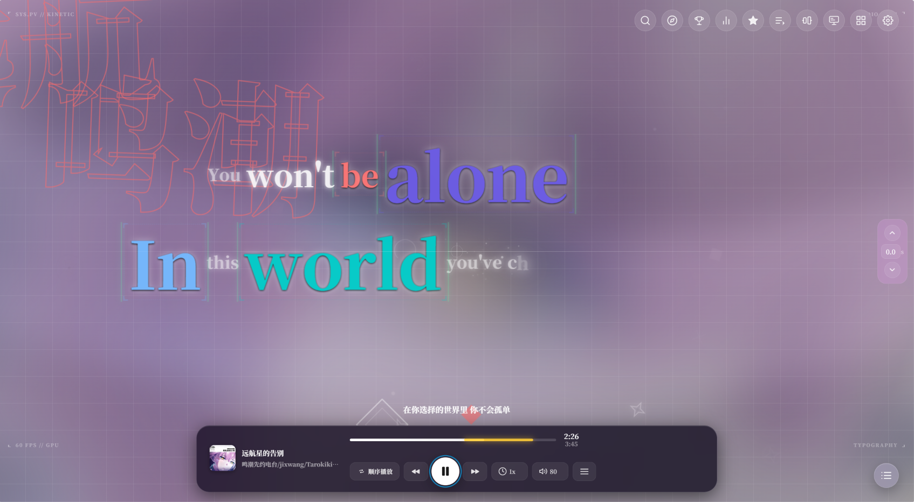
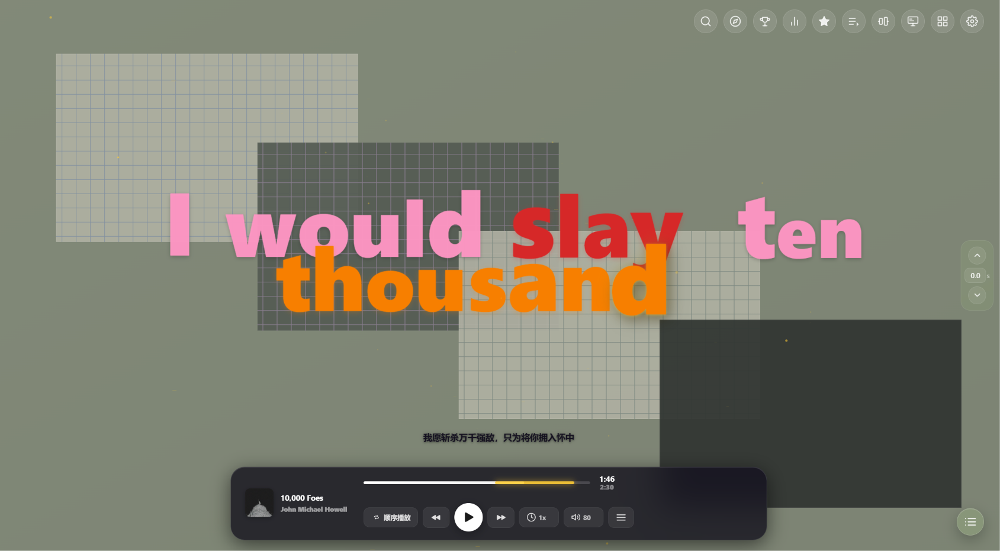
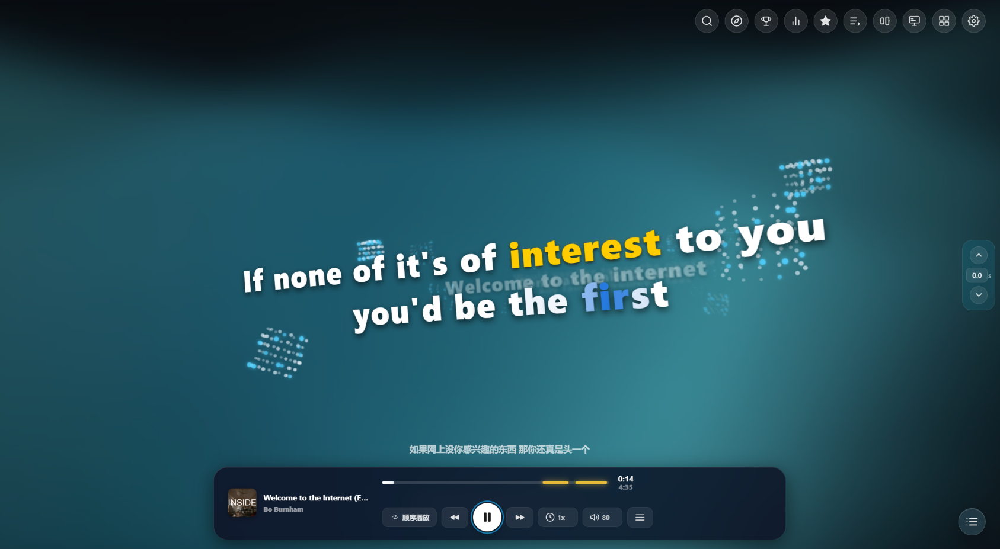
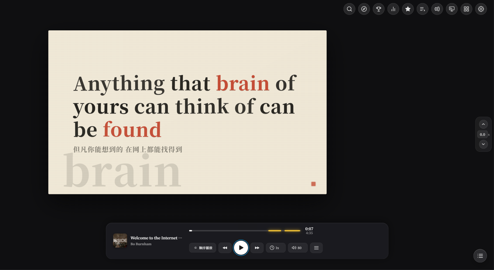
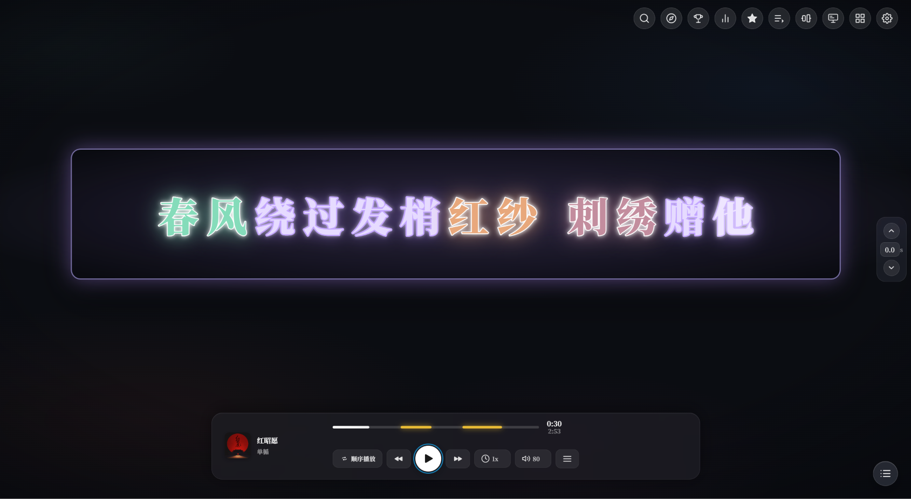
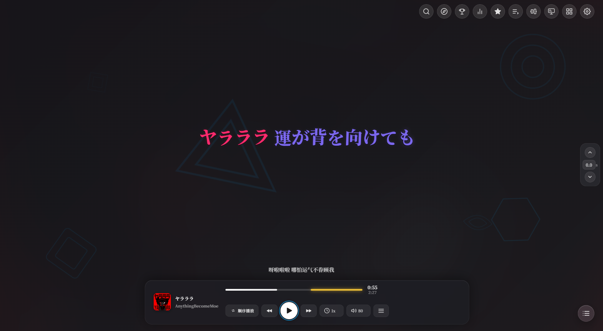
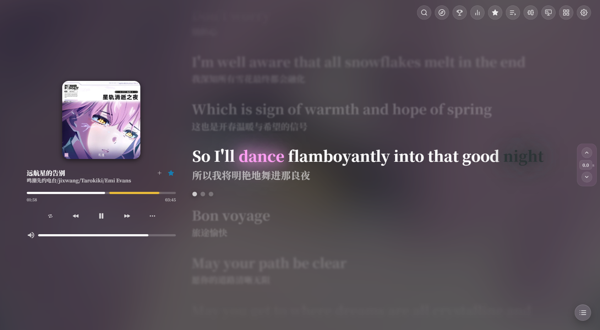
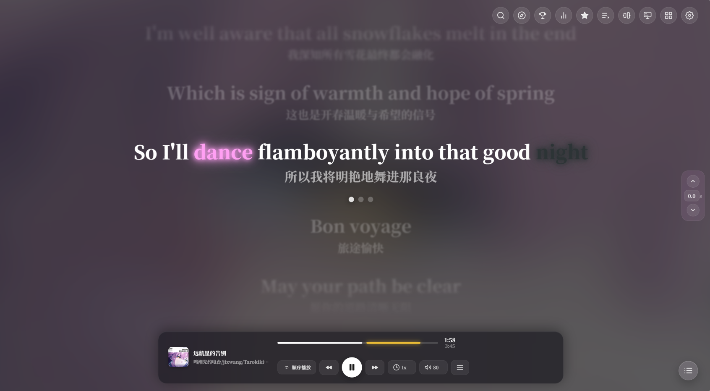

<div align="center">


# Aria 歌词播放器

**简体中文** | [English](README.en.md)

**多源在线音乐播放器，主打逐字歌词与歌词视觉：QQ / 酷狗 / 网易 / 酷我搜索，九种全屏歌词模式，桌面歌词，AI 情绪分析**

网页版 + Tauri 2 桌面壳，一个人长时间听歌用的播放器。

A multi-source online music player for Windows, built around word-by-word lyrics: 9 full-screen lyric visual modes, a desktop lyrics overlay, AI mood analysis, EQ and local music support.

[](LICENSE)
[](https://github.com/zsjsll114/Aria/actions/workflows/ci.yml)
[]()
[]()
[]()

[视觉展示](#九种歌词视觉) ·
[核心能力](#核心能力) ·
[快速开始](#快速开始) ·
[常见问题](#常见问题) ·
[架构](#架构简述) ·
[许可证](#许可证)

</div>

---

仅供个人使用。仓库不含任何音频、歌词或封面内容；在线音源接口由第三方开源项目在本机运行时提供，详见文末[免责声明](#第三方音源与免责声明)。

## 九种歌词视觉

| 模式 | 说明 |
|---|---|
| 拾光 · Lyrics | 默认。逐字高亮 + 平滑滚动，支持翻译/音译行 |
| 飞白 · Fly-In | 整句飞入，适合跟着唱 |
| 云涌 · WordCloud | 歌词聚合成词云，随播放浮动 |
| 绘卷 · PV | 分镜引擎：60 种版式按段落情绪轮换，海报式大字排版，带镜头运动与粒子 |
| 格律 · Mondrian | 蒙德里安色块拼画，七族版式 + 纵深穿梭，按段落情绪轮换，换段平滑变形 |
| 穿行 · Tunnel | 3D 粒子场景，多层视差运镜 |
| 活字 · Letterpress | 印刷台主题：逐字压印上墨，30 款版式轮换，纸色随段落情绪变化 |
| 霓虹 · Neon | 灯牌主题：未唱的字是熄灭灯管，唱到逐字通电点亮，店招水印 |
| 和鸣 · Harmony | 多角色对话式歌词合唱 |

<table>
  <tr>
    <td align="center" width="33%"><br><sub><b>绘卷 · PV</b></sub></td>
    <td align="center" width="33%"><br><sub><b>格律 · Mondrian</b></sub></td>
    <td align="center" width="33%"><br><sub><b>穿行 · Tunnel</b></sub></td>
  </tr>
  <tr>
    <td align="center"><br><sub><b>活字 · Letterpress</b></sub></td>
    <td align="center"><br><sub><b>霓虹 · Neon</b></sub></td>
    <td align="center"><br><sub><b>云涌 · WordCloud</b></sub></td>
  </tr>
  <tr>
    <td align="center"><br><sub><b>飞白 · Fly-In</b></sub></td>
    <td align="center"><br><sub><b>拾光 · Lyrics</b></sub></td>
    <td align="center"><br><sub><b>拾光 · Lyrics</b>（纯享版式）</sub></td>
  </tr>
</table>

PV 和蒙德里安在开启 AI 情绪分析后效果最好：AI 会为每句歌词做分页、情感标注与构图建议。没配 AI 也能用，只是构图与配色不会贴合歌词情绪。

阿拉伯语 / 希伯来语等 RTL 歌词在各视觉模式下自动从右往左点亮，无需手动设置。

## 核心能力

| 模块 | 说明 |
|---|---|
| 逐字歌词 | YRC / KRC / QRC 全格式逐字时间轴，原词 / 翻译 / 罗马音三行布局 |
| 多源搜索 | QQ 音乐 / 酷狗 / 网易 / 酷我，聚合兜底；自建服务高音质与每日推荐 |
| AI 情绪分析 | Gemini 逐句情感标注、高潮段落识别，PV / 蒙德里安 / 霓虹 / 活字随情绪换构图与配色 |
| 桌面歌词 | 独立透明窗口，自由拖动、点击穿透、逐字本地插值 |
| 本地音乐 | 本机扫描 + Enhanced LRC 逐字歌词生成 + 听歌识曲（Shazam / Vosk） |
| 歌单收藏 | 收藏 / 歌单 / 网易云 QQ 酷狗公开歌单导入 / 播放统计 |
| 音频 | 10 段均衡器、倍速（变速不变调）、无缝切歌淡入淡出、下载 |

## 快速开始

### 绿色版（普通用户）

到 [Releases](../../releases) 下载 `Aria-Portable-v1.0.0.zip`，解压到纯英文路径后：

- `Aria.exe` —— 桌面窗口版（推荐）
- `StartAria.bat` —— 浏览器网页版

不用装 Python / Node，依赖全部内置。

### 从源码运行

前置：Python 3.10+（后端只用标准库）、Node.js 16+（音源服务）、Git。桌面壳需 Rust 工具链。

```bat
:: 1. 拉取音源服务到 _eval\（不入库，全新 clone 必须执行一次）
scripts\setup-vendors.bat

:: 2. 启动本地服务（默认只监听本机）
python server.py

:: 3a. 网页版：浏览器打开 http://localhost:8001
:: 3b. 桌面版：双击「启动Tauri桌面版.bat」（首次会自动 cargo build）
```

macOS / Linux 没有 bat，按脚本内容手动执行即可。

## 使用须知（先读这三条）

1. **大陆用户若走 Cloudflare Worker 反代用 AI：页面地址必须用 `http://localhost:8001`**，不能用 `127.0.0.1`——Worker 按页面来源（Origin）校验，`127.0.0.1` 会得到 `403 Forbidden`。直连 Gemini API（不挂 Worker）没有这个限制，用什么地址打开都行。
2. **默认只监听本机。** 想用手机访问时执行 `python server.py --lan`。这会把搜索、代理和配置接口（含 AI Key）暴露给同网段设备，只在自己家的 WiFi 里用，用完关掉。
3. **音源服务需要单独登录。** 未登录时自动降级到免费源池：能搜能播，但没有高音质、每日推荐和收藏歌单。登录入口在「设置 → 自建服务」。

## 功能指南

### 桌面歌词

右上角「桌面歌词」按钮开启。拖动文字条移动位置，✕ 关闭，锁型按钮切换点击穿透。位置在拖动结束后自动保存。字号、颜色、描边、中英文字体在「设置 → 界面」里调。

### 字体

- 全局字体在「设置 → 字体」里选；各视觉模式可在「设置 → 外观」对应模式分栏里单独覆盖。
- **拖文件进字体文件夹即可**：把 `.ttf / .otf / .woff / .woff2` 放进项目根的 `src/font/`（没有就新建），刷新后自动出现在所有字体下拉里。
- 字体管理器按 衬线 / 黑体 / 楷体 / 像素 / 等宽 自动分类，支持分组折叠。
- 推荐字体（字库大、免费商用）：思源黑体（Noto Sans SC）、思源宋体、MiSans、HarmonyOS Sans、霞鹜文楷。
- **建议优先使用静态字重版本**：可变字体（VF，文件名常带 `-VF`）在全屏大字场景渲染开销较高，低端设备可能出现掉帧。

### 歌单与收藏

收藏：任意列表的行尾收藏按钮。歌单：左侧「歌单」页新建 / 重命名 / 删除，支持从网易云 / QQ / 酷狗的公开歌单链接导入。

### AI 情绪分析

「设置 → AI」里填 Gemini API Key。大陆网络建议配 Cloudflare Worker 反代（`docs/cf-gemini-auth-worker.js` 有现成脚本）；直连可填官方地址。Key 只存在本机 `user_config.json`，不上传到任何第三方。

## 已知限制

- 三个第三方音源 vendor 由上游代码自行监听 `0.0.0.0`（未传 host 参数），即使不开 `--lan` 仍会绑定全部网卡——彻底收口需给 vendor 打补丁，属未完成项。
- 多显示器 / 不同缩放率（DPR）组合未做完整测试，外接屏可能出现光标或定位偏移。
- 视觉模式在全屏 + 高帧率下 GPU 占用较高；最小化后渲染不会自动降帧。
- 可变字体（VF）做全局字体时，全屏大字的插值渲染开销较高，低端设备建议用静态字重版本（如思源黑体 Bold），或把性能档调低。
- 内嵌歌词（USLT / 多轨 AWLRC）的主轨识别在个别文件上可能选错轨道。

## 关于开发方式

本项目在 AI 的广泛协助下开发：产品形态、架构决策与代码审校由作者完成，大量实现、重构、测试与文档由 AI 协作产出。issue 里描述问题时不用特意区分是谁写的，照常提就行。

## 常见问题

- **打开白屏 / 连不上**：确认 server 窗口没关、8001 端口没被占用；桌面版看 `server_debug.log`。
- **搜索没结果**：换一个音源试试；都失败大概率是第三方接口临时不可用，过会儿再试。
- **高音质选项是灰的**：需要对应平台自建服务登录。
- **AI 全部报 403**：页面地址不是 `localhost`，回到须知第 1 条。
- **桌面歌词重启后位置不对**：拖动结束后等一下再关；仍不生效就锁定→解锁一次。

反馈问题请用 [ISSUE 模板](.github/ISSUE_TEMPLATE/bug_report.md)，附上 console 报错与系统信息能快很多。

## 架构简述

```
Tauri 2 壳（Rust）── 加载 http://localhost:8001，spawn 两个 sidecar
        │
Python 后端（纯标准库 http.server，端口 8001）
  ├ 静态服务 web/ + /proxy + /api/*
  └ selfhost_service.py：三个 Node 音源副进程（3100/3200/3201）
```

前端为无框架分片模块（`web/src/app/*.js` 按编号加载），视觉引擎在 `web/src/core/`（pvEngine / tunnelEngine / visualizers）。详细架构见 [AGENTS.md](AGENTS.md) 与 [CODE_WIKI.md](CODE_WIKI.md)。

## 第三方音源与免责声明

`_eval/` 目录下是三个第三方音源 API 项目的本地镜像（KuGouMusicApi / NeteaseCloudMusicApi / qq-music-api-node），由 `scripts/setup-vendors.bat` 克隆并安装，**不属于本仓库的一部分**，各自遵循其原始许可证，由原项目独立维护。本项目只是在本机 127.0.0.1 上调用它们，不修改其上游逻辑（`patches/` 里是对 QQ 镜像的本地修复，仅本项目使用）。

在此基础上：

1. 本仓库不包含、不分发任何音频、歌词或封面内容。媒体内容要么来自你本机已有的文件，要么由上述第三方接口在运行时返回。
2. 第三方接口随时可能变更或失效，本项目不做任何可用性承诺。
3. 本项目是个人学习与自用目的的播放器前端，请自行确认所在地区对相关服务的使用条款与版权规定，优先支持正版。请勿将本项目或其打包产物用于商业分发。

## 致谢

- [folia-major](https://github.com/chthollyphile/folia-major) —— 本项目视觉分镜设计的参考来源
- [KuGouMusicApi](https://github.com/makbkf/KuGouMusicApi) / [NeteaseCloudMusicApi](https://github.com/Binaryify/NeteaseCloudMusicApi) / [qq-music-api-node](https://github.com/jsososo/QQMusicApi) —— 音源接口
- [Tauri](https://tauri.app/) · [segmentit](https://github.com/nekobato/segmentit) · [kuromoji.js](https://github.com/takuyaa/kuromoji.js)
- 字体：思源黑体 / 思源宋体（Noto CJK，SIL OFL）· 霞鹜系列 · 方舟像素 · Cubic 11

## 许可证

[MIT](LICENSE)。仅覆盖本仓库自有源代码，不含 `_eval/` 下的第三方项目。

## 相关文档

- [AGENTS.md](AGENTS.md) —— 运行时架构与硬性约束速查
- [CODE_WIKI.md](CODE_WIKI.md) —— 模块演进历史
- [docs/打包分发方案.md](docs/打包分发方案.md) —— 绿色版打包
- [docs/歌词模式视觉规范.md](docs/歌词模式视觉规范.md) —— 各歌词模式的排版与视觉规则
